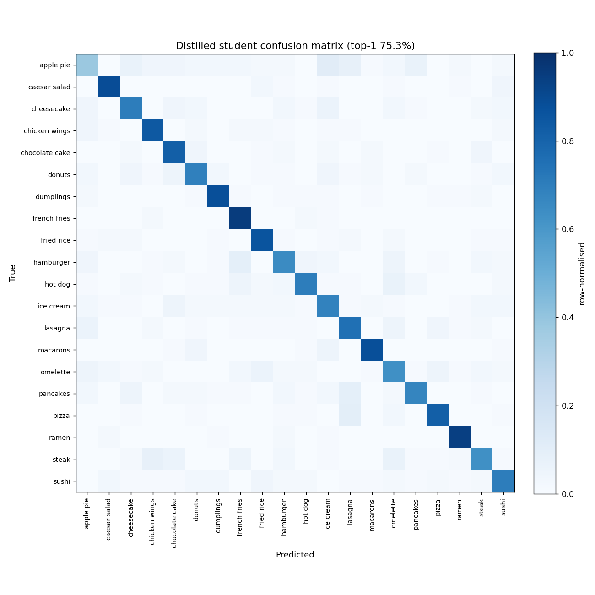
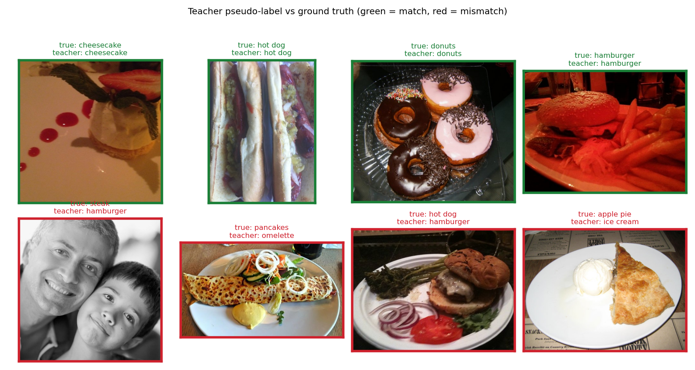

# Distilling a Vision-Language Model into a Compact Food Classifier

How much of a large **vision-language model's** food knowledge can be transferred
into a tiny, deployable image classifier — using *only the VLM's own labels*, with
no human annotation?

This repo is a small, reproducible study of **VLM-as-annotator knowledge
distillation**:

1. Treat a labelled public dataset (**Food-101**) as if it were *unlabelled*.
2. Use an open vision-language model (**Qwen2-VL**) as a **teacher** to produce
   pseudo-labels for the training images.
3. Train a compact **student** CNN (a few MB) on those pseudo-labels only.
4. Evaluate honestly on the held-out test set, against three references:
   - the **teacher** itself (zero-shot VLM accuracy),
   - an **oracle student** trained on the *true* labels (the ceiling),
   - so the **distillation gap** (pseudo-label noise cost) is explicit.

The interesting question isn't "is the number high?" — it's *how much accuracy
survives the trip from a multi-billion-parameter VLM down to a ~2–6 MB model that
runs at tens of FPS on a CPU*, and how much is lost to pseudo-label noise.

> Everything runs free on a single Colab/Kaggle GPU. The teacher is open-weight,
> so there are **no API costs**. A 20-class subset trains end-to-end in well under
> an hour.

## Why this is worth reading

- **No labels required.** The student never sees a human annotation — only the
  teacher's guesses. This is the realistic setting when you have images but no
  budget to label them.
- **Honest evaluation.** Most "distillation works!" writeups omit the oracle
  ceiling and the pseudo-label quality. Both are reported here, so the cost of
  noisy supervision is visible rather than hidden.
- **Deployable student.** The student is a `timm` MobileNet/EfficientNet — small
  enough for edge/CPU inference, which is the whole point of distillation.

## Results

20-class Food-101 subset · ≤150 train / 100 test images per class (2,000 test
images) · teacher **Qwen2-VL-2B-Instruct** · student **MobileNetV3-Small**
(`timm`) · 12 epochs. Reproduce with the [Colab notebook](notebooks/colab_quickstart.ipynb),
then `python -m vlm_food_distill report` to regenerate the table.

| Model | Params | Top-1 (test) |
|---|---|---|
| Teacher (Qwen2-VL-2B, zero-shot) | ~2 B | **95.8%** |
| **Student (distilled from pseudo-labels)** | ~1.5 M | **74.5%** |
| Oracle student (trained on true labels) | ~1.5 M | 75.1% |
| _Pseudo-label accuracy (teacher vs true, train)_ | — | 93.6% |

**What this shows**

- **Pseudo-labels cost almost nothing.** The distilled student (74.5%) lands within
  **0.6 pp** of the oracle student trained on ground-truth labels (75.1%) — because
  the teacher's pseudo-labels were **93.6%** accurate. With *zero human annotation*,
  the VLM's own labels were nearly as good as the real ones.
- **The real price is compression.** Going from a ~2-billion-parameter VLM (95.8%)
  to a **~1.5 M-parameter, ~6 MB** CNN that runs at tens of FPS on a CPU costs ~21 pp
  of accuracy — the trade you make for a deployable edge model.
- **Takeaway:** for a fixed student, label *source* mattered far less than label
  *quality*, and an open VLM supplied that quality for free. The lever for closing
  the remaining gap is student capacity / training budget, not better labels.

### Figures

| Distilled student — confusion matrix | Teacher pseudo-label vs ground truth |
|---|---|
|  |  |

Regenerate with:

```bash
python -m vlm_food_distill plot --config configs/subset20.yaml --data-root ./data \
    --student runs/student.pt --labels runs/pseudo_labels.csv --out-dir assets
```

(The example grid intentionally mixes correct (green) and incorrect (red) teacher
calls so the pseudo-label noise is visible rather than cherry-picked.)

## Pipeline

```
Food-101 (treat train as unlabelled)
        │
        ▼
  Qwen2-VL teacher  ──►  pseudo-labels.csv   (teacher's class guess per image)
        │
        ▼
  timm student (MobileNetV3 / EfficientNet)  ──►  student.pt
        │
        ▼
  evaluate on Food-101 test split  ──►  results.json  ──►  report
```

## Quickstart (Colab — recommended)

Open `notebooks/colab_quickstart.ipynb` in Colab (GPU runtime) and run all cells.
It installs deps, then runs the four stages below on a 20-class subset.

## Quickstart (local / CLI)

```bash
pip install -r requirements.txt

# 1. Pick a subset and download Food-101 (torchvision handles the download)
python -m vlm_food_distill subset --config configs/subset20.yaml --data-root ./data

# 2. Teacher labels the (treated-as-unlabelled) training images
python -m vlm_food_distill label --config configs/subset20.yaml --data-root ./data \
    --out runs/pseudo_labels.csv

# 3. Train the compact student on the teacher's pseudo-labels
python -m vlm_food_distill train --config configs/subset20.yaml --data-root ./data \
    --labels runs/pseudo_labels.csv --out runs/student.pt

# 4. Evaluate teacher / student / oracle on the held-out test split
python -m vlm_food_distill eval --config configs/subset20.yaml --data-root ./data \
    --student runs/student.pt --labels runs/pseudo_labels.csv --out runs/results.json

python -m vlm_food_distill report --results runs/results.json

# 5. (optional) Save the confusion matrix + teacher-vs-truth figures to assets/
python -m vlm_food_distill plot --config configs/subset20.yaml --data-root ./data \
    --student runs/student.pt --labels runs/pseudo_labels.csv --out-dir assets
```

## Configuration

`configs/subset20.yaml` controls the class subset, teacher model id, student
architecture, and training hyper-parameters. Swap to the full 101 classes by
emptying the `classes:` list (uses all of Food-101) at the cost of a longer run.

## Method notes

- **Teacher prompting.** Qwen2-VL is shown each image and the candidate class
  list, and asked to return exactly one class name. Free-text replies are mapped
  back to the closest class; unparseable replies are dropped (and counted).
- **This is "output distillation"** (a.k.a. pseudo-labelling / self-training with
  a VLM teacher), not logit/soft-target distillation — a VLM doesn't expose
  calibrated class logits. The student learns from the teacher's *hard decisions*.
- **Fair comparison.** Student and oracle share architecture, augmentation, and
  schedule; the only difference is the label source (teacher vs ground truth).

## Limitations

- Pseudo-labels are noisy; accuracy is bounded by teacher quality on this domain.
- A small subset is used by default for speed; the full set will shift numbers.
- Single train/test split, no cross-validation — this is a demonstration, not a
  benchmark submission.

## License

MIT — see [LICENSE](LICENSE).
